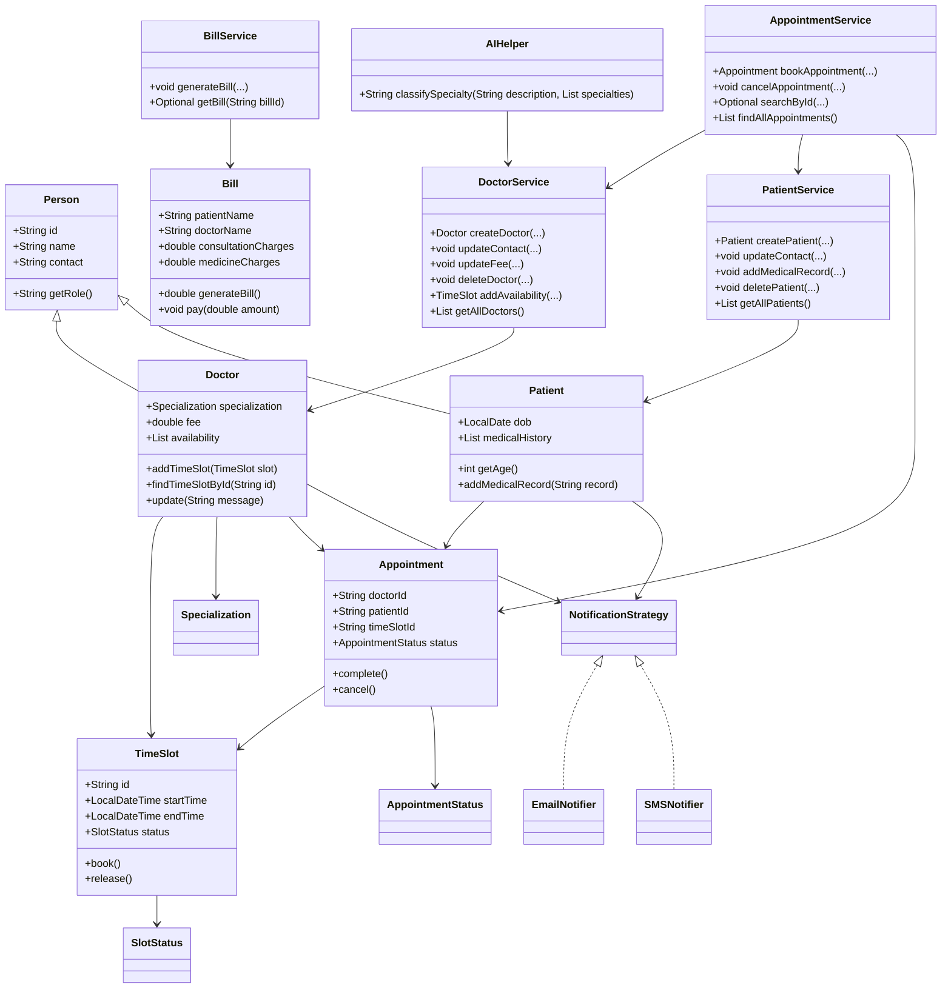

# MediTrack

MediTrack is a Java-based clinic and appointment management system designed to model day-to-day healthcare operations such as doctor management, patient management, appointment booking, billing, and AI-assisted specialty suggestions.

## Project Overview

This application simulates a clinic workflow where administrators can:
- register doctors with their specialization and consultation fee
- manage patient information and medical history
- create time slots for doctors
- book and cancel appointments
- generate bills based on consultation and medicine charges
- apply billing strategies such as standard pricing and discount-based pricing
- receive notifications through strategies like email and SMS
- use an AI helper to suggest probable doctor specialization based on patient symptoms

## Core Features

### Doctor Management
- Create doctors with name, contact, specialization, and fee
- Update doctor contact or consultation fee
- Search doctors by ID or name
- Filter doctors by specialization
- Add appointment availability time slots

### Patient Management
- Create patient profiles with DOB, name, and contact
- Update patient contact details
- Add medical records/history
- Search patients by ID, name, or age
- Delete patient records when needed

### Appointment Management
- Book appointments for a specific doctor and patient using a selected time slot
- Prevent double-booking by locking the time slot state
- Cancel appointments and release the slot back to available status
- Search for appointments by ID or view all appointments

### Billing Module
- Generate bills with consultation and medicine charges
- Apply billing strategies such as standard tax-based billing and discount billing
- Process payment through different payment modes
- Retrieve bills by ID

### Notification Strategy Pattern
- Supports pluggable notification strategies
- Example implementations include Email and SMS notification
- Notification behavior is integrated into doctor and patient entities

### AI Assistant
- Uses a Java HTTP client to call a Gemini-compatible API when an API key is available
- Classifies symptoms into a suggested medical specialty
- Falls back to "General Physician" if no API key is configured or API access fails

## Architecture and Design Highlights

The project demonstrates several object-oriented and design principles, including:
- Encapsulation through entities and service classes
- Abstraction using interfaces such as `Searchable`, `BillingStrategy`, and `PaymentStrategy`
- Strategy Pattern for notifications and billing calculations
- DataStore utility for in-memory persistence
- Singleton pattern in `IdGenerator` and `AIHelper`
- Defensive copying in entity getters where needed

## Project Structure

```text
MediTrack/
├── src/
│   └── com/
│       └── airtribe/
│           └── meditrack/
│               ├── constants/
│               ├── entity/
│               ├── exception/
│               ├── interfaces/
│               ├── service/
│               ├── util/
│               ├── tests/
│               └── Main.java
├── README.md
├── Setup_Instructions.md
├── JVM_Report.md
├── .gitignore
├── MediTrack.iml
└── out/
```

## UML Class Diagram




## Technologies Used

- Java SE
- Object-oriented programming
- Java standard library collections and time APIs
- HTTP client for AI integration
- Git for version control
